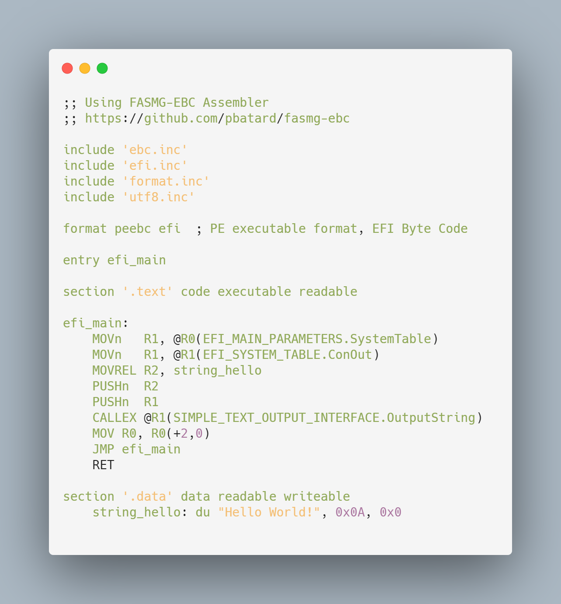

# Spore - UEFI Bytecode Disassembler

> A disassembler for the UEFI Bytecode Virtual Machine.

### About

<!-- <table>
    <tr>
        <td>
            Assembly written using FASMG-EBC UEFI Bytecode Assembler
            
            
        </td>
        <td>
            Output
            
            
        </td>
    </tr>
</table> -->

### Usage

