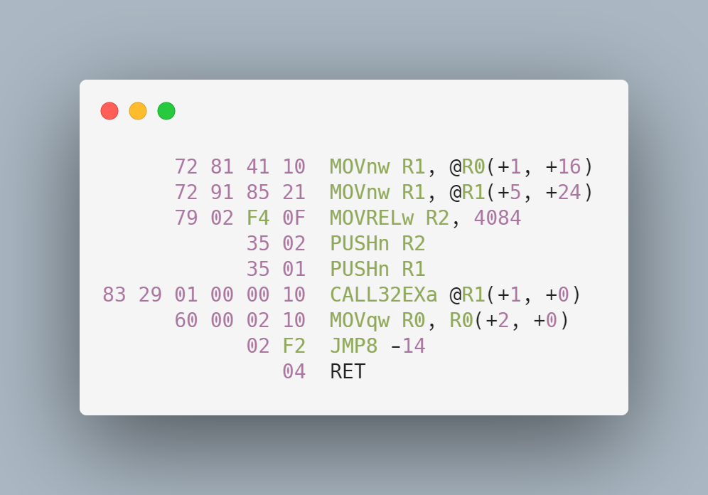
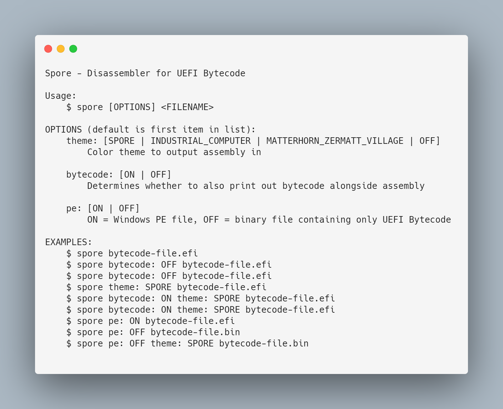
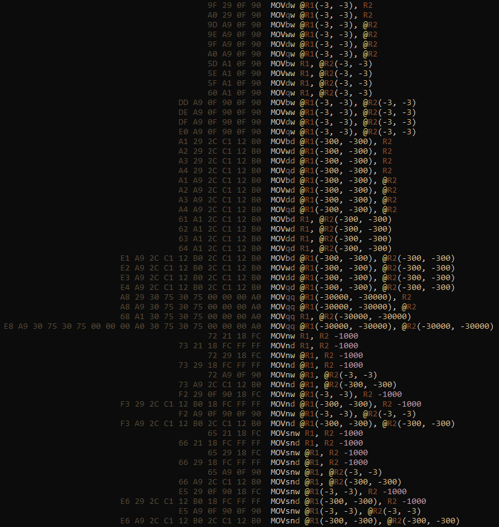

# Spore - UEFI Bytecode Disassembler

<table>
    <tr>
        <td>
            
        </td>
        <td>
            
        </td>
    </tr>
</table>

> 🍄 A disassembler for the UEFI Bytecode Virtual Machine. For details on the
VM, see [section 22 of the UEFI Specification](https://uefi.org/sites/default/files/resources/UEFI_Spec_2_9_2021_03_18.pdf).

## Installation

```bash
$ cargo install spore-disassembler

# Or alternatively
$ cargo install --git https://github.com/Pebaz/spore
```

## Demo

Although Spore will work with any EBC binary, users will most likely benefit
from [fasmg-ebc-rs](https://github.com/Pebaz/fasmg-ebc-rs) which makes it much
simpler to work with the [fasmg-ebc](https://github.com/pbatard/fasmg-ebc)
assembler.

Given the following fasmg-ebc UEFI Bytecode Assembly file:

```x86asm
;; Adapted from https://github.com/pbatard/fasmg-ebc/blob/master/hello.asm

include 'ebc.inc'
include 'efi.inc'
include 'format.inc'
include 'utf8.inc'

format peebc efi  ;; PE executable format, EFI Byte Code

entry efi_main

section '.text' code executable readable

efi_main:
    MOVn   R1, @R0(EFI_MAIN_PARAMETERS.SystemTable)
    MOVn   R1, @R1(EFI_SYSTEM_TABLE.ConOut)
    MOVREL R2, string_hello
    PUSHn  R2
    PUSHn  R1
    CALLEX @R1(SIMPLE_TEXT_OUTPUT_INTERFACE.OutputString)
    MOV R0, R0(+2,0)
    JMP efi_main
    RET

section '.data' data readable writeable
    string_hello: du "Hello World!", 0x0A, 0x0
```

Compile it using [fasmg-ebc-rs](https://github.com/Pebaz/fasmg-ebc-rs) by using
the below command:

```bash
$ cargo install fasmg-ebc-rs
$ fasmg-ebc-rs bc.asm bc.efi

# This is a PE executable that contains UEFI Bytecode
$ file bc.efi
bc.efi: PE32+ executable (DLL) (EFI application) EFI byte code, for MS Windows
```

Now that we have a bootable PE executable, we can output the bytecode
instructions inside of it:

```bash
$ spore bc.efi
```

The disassembled bytecode instructions are then emitted by Spore:

```x86asm
      72 81 41 10  MOVnw R1, @R0(+1, +16)
      72 91 85 21  MOVnw R1, @R1(+5, +24)
      79 02 F4 0F  MOVRELw R2, 4084
            35 02  PUSHn R2
            35 01  PUSHn R1
83 29 01 00 00 10  CALL32EXa @R1(+1, +0)
      60 00 02 10  MOVqw R0, R0(+2, +0)
            02 F2  JMP8 -14
               04  RET
```

## Usage

<p align=center>
    
</p>

## Why

I am learning about making operating systems because I think it is fun. It is
actually quite difficult, but the rewards are pretty satisfying.

While learning about operating systems, I discovered the Unified Extensible
Firmware Interface (UEFI). It's basically a set of C ABI interfaces that allow
you to write pre-OS recovery software, OS installers, or boot managers.

The UEFI Virtual Machine is literally preinstalled by default on most modern
motherboards. Most of the time, you write applications that adhere to the UEFI
API in C, and then you can boot into them directly. Astoundingly, you can also
boot right into applications written with UEFI Bytecode (EBC)!

The reason this is astonishing is that EBC is cross-platform, so it
is truly like Java Bytecode in that regard.

Even more surprising is that EBC has access to the same Boot &
Runtime Services that normal UEFI applications have. *This means you can write
a bootloader using EBC.*

After I discovered this I set out to learn UEFI Bytecode, but didn't find very
much on it. Thankfully, [Pete Batard](https://github.com/pbatard) built
[FASMG-EBC](https://github.com/pbatard/fasmg-ebc), an assembler for EBC.

I wanted to better understand the output of the assembler and to do that, I
would need to work with it more. That's when I decided to build Spore. 😄

## How did I do it?

I started out by perusing the [UEFI Specification](https://uefi.org/sites/default/files/resources/UEFI_Spec_2_9_2021_03_18.pdf)
very carefully and found that all of the information I would need was contained
in section 22. From there, I decided to use Rust to build the disassembler
since it is my current favorite language for many reasons.

I then created a Python script that would generate some specific bytecode
sequences without having to deal with the PE file format. This was one of the
most important steps in the entire project because I learned how to interpret
the binary structure of a few of the instructions.

Once I had some bytes to work with, I wrote some Rust code that would open the
file and iterate through the bytes. Amazingly enough, the entire application
runs by passing a single iterator to all the functions that parse out
instructions! All the parsing functions just advance the iterator and return
any errors.

This really made the whole process easier because all I had to do was look at
the first byte to determine the opcode of the instruction and route it to the
appropriate parser function. Since many instructions have varying lengths of
bytes, the iterator approach worked amazingly well.

After I had written a fair bit, I noticed that many of the instructions were
using the exact same parsing routines. I also noticed that I was implementing 1
instruction at a time and there were 55 total instructions so this was not
going to work well. I then had to step back and see what could be reused and
what had to be kept. I then read through all 55 instructions in the
specification and grouped each instruction type by how it was parsed. Once that
was done, I just had to write 1 parsing function per type (total of 7)!

At this point, I knew what I was getting myself into and determined that I
needed to have some better unit testing to ensure I was not messing anything up
during refactoring. I had been incrementally adding to the Python script to
output each and every instruction as well as every combination of arguments but
I knew that I would need to somehow verify that I was not breaking anything.

The bytecode generator script looked like this:

```python
bc = open('bc.bin')

bc.write(0b00101010_00000001.to_bytes(2, 'big'))  # $ STORESP R1, FLAGS

# The rest of the instructions ...
# This totaled 1162 lines of code
```

I wrote another Python script that would scrape out all of the assembly
instructions from the bytecode generation script and write them to a file.

It worked by looking for all the comments that contained the dollar sign `$`
and writing them to a file. The result looked like this:

```x86asm
STORESP R1, FLAGS

;; The rest of the instructions
```

Now that I had what I expected to come out of the disassembler, I could simply
compare the output with this file to determine if I had any regressions!

Once I had this, I could implement the rest of the instruction parsers and
modify the existing ones at will and be sure that nothing would break.

Implementing the rest of the parsers took a while, but once I was done, I
needed to convert the Python test scripts to Rust unit tests.

Again, I started by converting them one at a time by hand, but this soon became
slightly ridiculous.

I wrote another Python script that parsed the `bc.write(...)` directives from
the bytecode generator script and converted them to Rust unit tests. This was
immensely satisfying! 🙃

Once I had working Rust unit tests, I went on to polish the CLI and fix bits
and bobs of miscellaneous todo items. The rest is what you see in this README!



**All in all, the project took me 20 days to complete.**

Some things that I noticed while working on Spore:

* Python was absolutely essential for rapid prototyping. I will continue to
  remember how well Rust + Python pair together for future projects. I used
  Python for:
    * Generating bytecode
    * Verifying disassembler output
    * Converting Python tests to Rust unit tests
* Rust was amazing to use because it did not force me to think about
  structuring my code. It was just functions + structs + 1 trait 😛
    * One other thing that was amazing was that after I got the code to
      compile, very rarely was it incorrect. Rust's compiler is world-class. It
      also made refactoring fearless because I knew it would catch all the
      things.
* The Rust ecosystem is amazing. I needed a PE file loader, so I used the
  [pelite](https://github.com/CasualX/pelite) crate, and it was a breeze.
* The [colored](https://github.com/mackwic/colored) crate made outputting
  colored text very fun!
* Rust doesn't have a Vec-like data structure that is allocated on the stack. I
  know this might be a strange requirement, but I don't like allocating
  everything on the heap all the time. The [arrayvec](https://github.com/bluss/arrayvec)
  crate allowed me to have a fixed-size buffer that had a Vec-like interface.
* I used `include_str!()` for the CLI usage information and this was oddly
  satisfying! 😆
* Strings. Let's talk about strings. I mean, why can't I stack allocate them
  very easily? I essentially want like a stack-allocated string builder to
  allow me to not make even a single allocation but implementing this would
  have taken forever. 😕

## Stargazers over time

[](https://starchart.cc/Pebaz/Spore)

## Notes

* 🍄 Spore is named after mushroom spores.
* 👏 Thank you to [Pete Batard](https://github.com/pbatard) for creating
  [FASMG-EBC](https://github.com/pbatard/fasmg-ebc) which is based on the Flat
  Assembler. Without this tool, I would not have had the assembly files to
  disassemble!
* 🤯 The [UEFI Specification](https://uefi.org/sites/default/files/resources/UEFI_Spec_2_9_2021_03_18.pdf)
  is exceptionally well-written and contained all the information necessary to
  implement Spore.
* 🤷‍♂️ Although Spore is cross-platform (Windows, MacOS, Linux), I have not tested
  whether FASMG-EBC works on other platforms.
